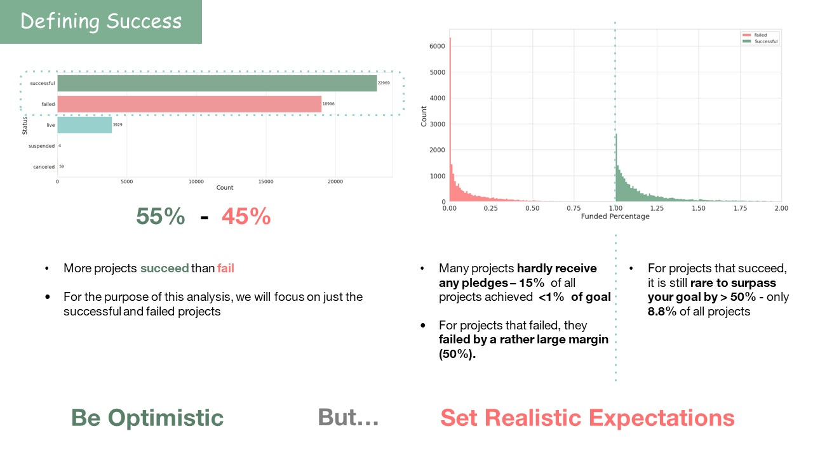
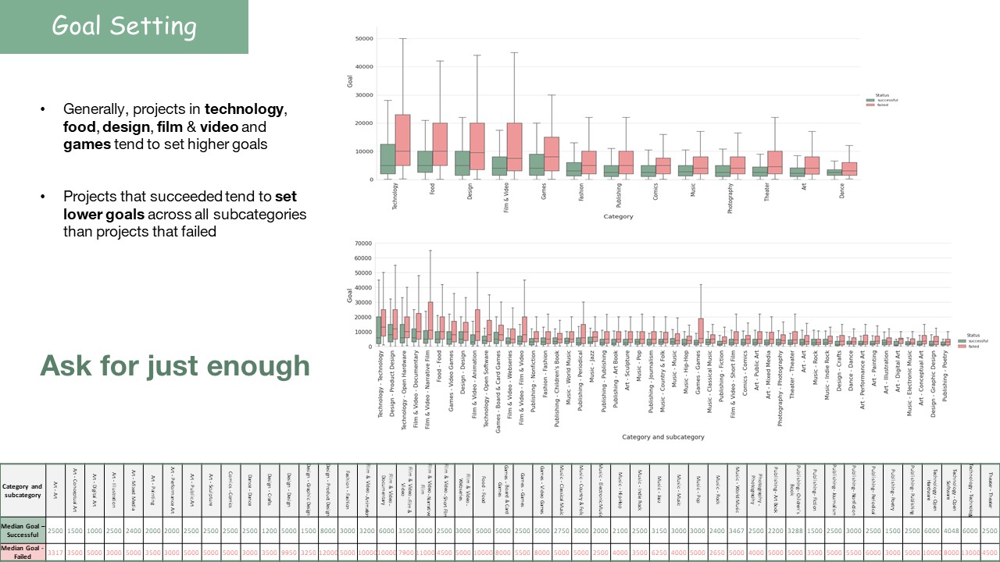
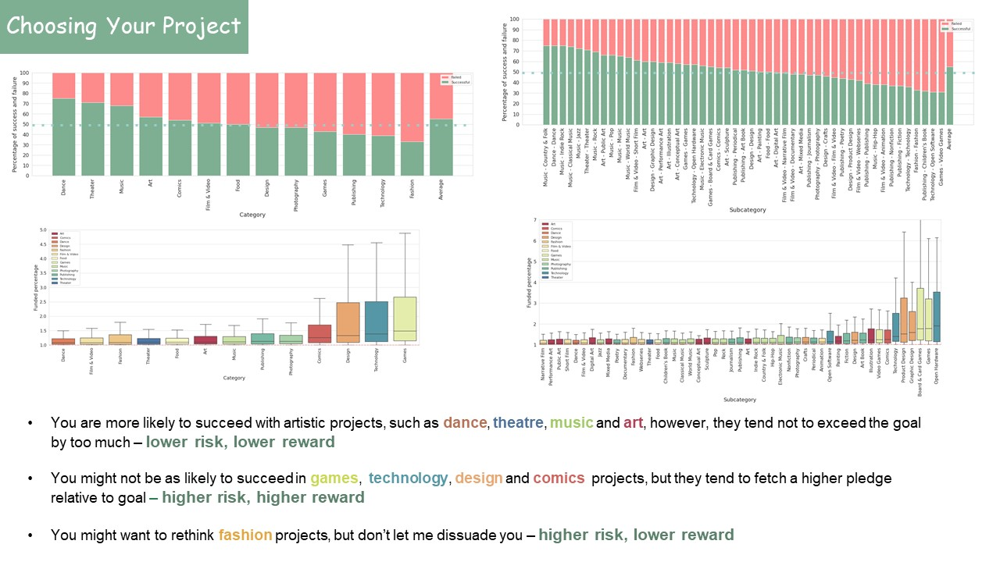
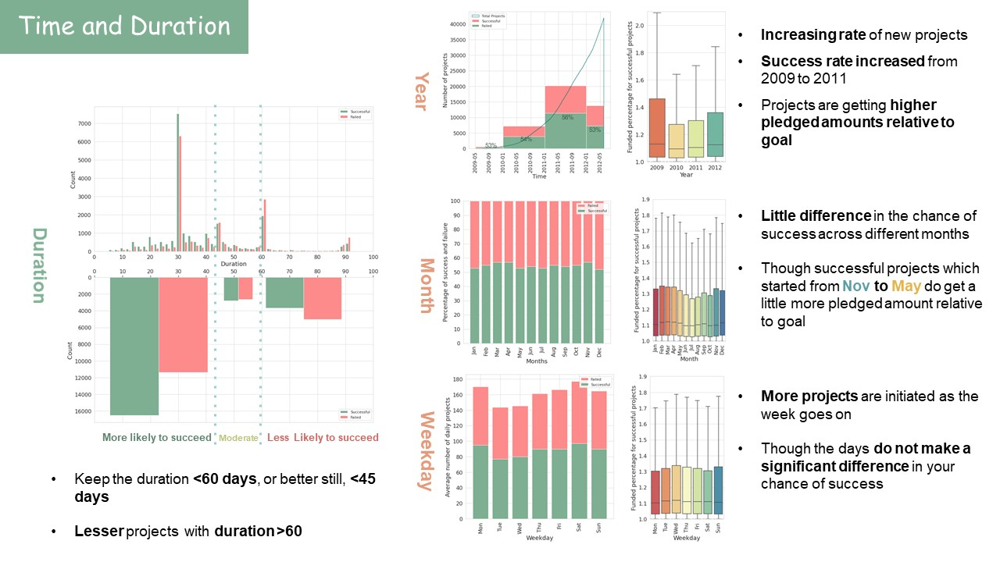
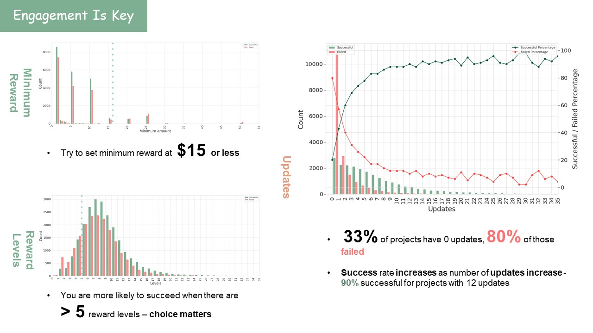

# Kickstarter dataset Analysis

## Background

**Kickstarter** is a crowdfunding platform where backers could pledge fundings in order to bring a creative project to life. The genre of projects could range from film, music, games, food, or anything under the sun. Since its inception in 2009, it has gained widespread popularity and is now one of the largest crowdfunding platforms out there.

But what is a good kickstarter project? What kind of project will give you successful funding? The genre of the project? The funding goal? The level of engagement? The year? Month? Day of week? This project aims to provide insights to a successful kickstarter project by analysing a set of kickstarter projects from 2009 to 2012. 

## Dataset

The dataset consists of 45958 projects, with 16 features, collected from 2009 to 2012.

Features:
- project id
- project name
- project url
- category 
- subcategory
- location
- status
- goal
- pledged
- number of backers
- funded date
- reward levels
- number of reward levels
- number of updates
- durations
- number of comments

## Conclusion

First, we take a look at how the projects in our datasets do when it comes to achieving success.

What is the funding a project should set? We take a look at the goals for successful and unsuccessful projects

Next, what kind of projects should we pursue? Here, we look at the type of projects and their rates of success.

Does keeping funding durations longer gives you a higher rate of success? Not really. Here, we examine the success rate and funding with respect to some time variables

Keeping the backers engaged is important to getting more backers. Releasing regular updates helps to keep the potential backers engaged. Sometimes, just 1 update makes all the difference.

